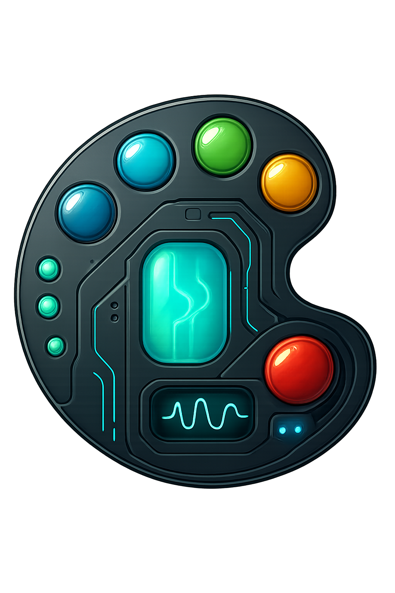
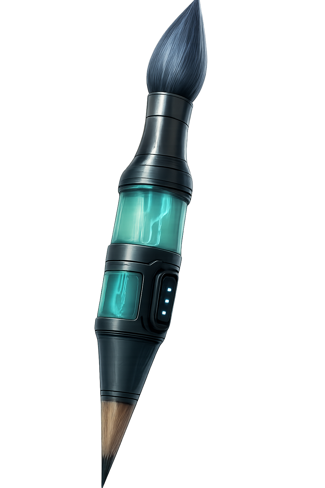

    

-------

# Projeto EBOOK Gerado por I.A.s

 > ℹ️ **NOTE:** Desenvolvido durante o curso de IA generativa na plataforma da [DIO](https://dio.me)

Projeto com o objetivo de gerar um ebook digital com as facilidades das ferramentas de IA. todos os prompts
seguem abaixo.

<a href="Output/ebook - cltrl+arte+ia.pdf"> 📕Clique aqui para ler</a>

## 💻 Tecnologias utilizadas no projeto

- [ChatGPT](https://chat.openai.com/) 
- [Copilot](https://copilot.microsoft.com/)
- [PowerPoint](https://www.microsoft.com/en/microsoft-365/powerpoint)

## 🧠 Prompts

ChatGPT：

|   Ação   | prompt                                                                                                                                                                                                                                                                         |
| :------: | ------------------------------------------------------------------------------------------------------------------------------------------------------------------------------------------------------------------------------------------------------------------------------ |
|  título  | crie um titulo para um e-book sobre tecnologia, especificamente do nicho de inteligência artificial e sub nicho de produção digital de arte, e que tenha em seu titulo uma temática que brinque com esse nicho e sub nicho nerd. Me gere 6 variações                                                        |
| conteúdo | Faça um texto para ebook, com foco no assunto que a gente conversou acima, listando os principais assuntos sobre o tópico de Tecnologia envolta da inteligenci artificial e como o mundo da arte e criatividade esta lidando e se adaptando com isso e suas resistências. (Regras) explique sempre de uma maneira deixe o texto enxuto sempre traga exemplos reais que acontecem no cotidiano sempre deixe um texto sugestivo por tópico |

Copilot：

|  Ação  | prompt                                                                                 |
| :----: | -------------------------------------------------------------------------------------- |
| título | A writter, middle aged, atmosphere surrealist, using a technology brunch look directly from ahead, this art having a realistic style |

## ✨ Features

- Conteúdo gerado via ChatGPT
- Imagens geradas via Copilot

## 📚 Materiais

- Imagens utilizadas em `Assets`
- ebook gerado durante as aulas em `Output`

## 🛠️ Instruções de execução

Utilize os prompts acima nas ferramentas sugeridas para gerar o material base e utilize uma ferramenta de edição de documentos como power point, libreoffice , indesign para diagramação.

## 🧑🏿‍🎓 Aluno

    
    
&nbsp&nbsp&nbspWerick Gomes 
    &nbsp&nbsp&nbsp
    <a href="https://github.com/romagitwel?tab=repositories">
    GitHub</a>&nbsp;|&nbsp;
    <a href="https://www.linkedin.com/in/werick-gomes/">LinkedIn</a>
&nbsp;|&nbsp;
    <a href="">
    Instagram</a>
&nbsp;|&nbsp;

  

